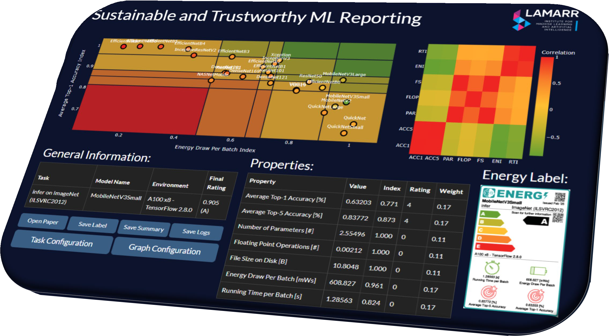

# LET - Lamarr Energy Tracker
<div style="display:flex; align-items:center; gap:1rem; flex-wrap:wrap;">
  <div>
    
  </div>
  <div style="flex:1; min-width:240px;">
A simple wrapper around <a href="https://mlco2.github.io/codecarbon/motivation.html">CodeCarbon</a> for tracking and reporting local energy consumption from Python.
  </div>
</div>

## Features
- 🧩 Simple extension to CodeCarbon software
- 👨‍💻 Three lines of code to report on environmental impacts of your research experiments
- 🔍 Enables smart assessment of [Ground-Truth Energy Consumption](https://arxiv.org/abs/2509.22092)
- 📈 Integrates with [STREP](https://github.com/raphischer/strep) for resource-versus-quality comparisons
- 💚 Help to make AI research and the Lamarr Institute more resource-aware

## 💻 Installation

As a Python library, you can simply install it by running

```bash
pip install lamarr-energy-tracker
```

## ⚡ Usage

LET should be used for custom compute setups (e.g., experiments running on a desktop, workstation, laptop).
If you use the [Lamarr Cluster](https://gitlab.tu-dortmund.de/lamarr/lamarr-public/cluster), your resource consumption will be automatically tracked (more info soon), so you do not need to use LET.
You can integrate LET in your Python code like this:

```python
from lamarr_energy_tracker import EnergyTracker

# Either use as a context manager
with EnergyTracker(project_name="your_research_project") as tracker:
    # Your resource-heavy code here
    pass

# Or manually
tracker = EnergyTracker(project_name="your_research_project")
tracker.start()
# Your resource-heavy code here
tracker.stop()
```

Once stopped, the tracker will print the energy consumption of your experiment as well as a summary statement that you can copy into your paper, describing the environmental impact of all your performed experiments for the given project and hardware:

***Using CodeCarbon 3.2.3, the energy consumption of running all experiments on an Intel(R) Core(TM) i7-10610U CPU is estimated to 0.135 kWh.
This corresponds to estimated carbon emissions of 0.051 kg of CO2-equivalents, assuming a carbon intensity of 380 gCO2/kWh~\cite{lamarr_energy_tracker,codecarbon}.
Note that these numbers are underestimations of actual resource consumption and do not account for overhead factors or embodied impacts~\cite{ai_energy_validation}.***

Per default, the tracker stores data about tracked resource consumption in a central `emissions.csv` file, located in `~/.let/`.
You can provide a different `output_dir` or access the tracking results as follows (use arguments to only investigate specific projects):
```python
from lamarr_energy_tracker import load_summary, print_paper_statement, delete_results

# access a pandas dataframe with all tracked resource data
df = load_results()
# print the summary of all tracked resource data
print_paper_statement()
# delete the centrally stored resource data
delete_results()
```

You can also print the statement directly from the terminal:
```bash
python -m lamarr_energy_tracker.print_paper_statement # Default arguments

python -m lamarr_energy_tracker.print_paper_statement --output_dir DIR --project_name NAME --hostname HOST # For additional filtering
```

## ❓ Assumptions and Estimation Errors
As mentioned in the impact statement above, the information obtained by CodeCarbon and LET are mere estimates of the [ground-truth energy consumption](https://arxiv.org/abs/2509.22092).
The tracking works especially well for NVIDIA GPUs (via NVML) and Linux setups, however dynamic CPU profiling with RAPL requires to run all code with `sudo`.
If you want to run code without `sudo`, you can also run our [RAPL access rights script](./scripts/rapl_access.sh) before executing your code.

While the tracker assumes that all code is executed in Germany, you can also provide a different `country_iso_code` to change the [carbon intensity constant](https://github.com/mlco2/codecarbon/blob/master/codecarbon/data/private_infra/global_energy_mix.json), among some other arguments. For more information on the methodology and shortcomings of the tracker, please refer to the [CodeCarbon documentation](https://mlco2.github.io/codecarbon/motivation.html).

If you use some other energy estimation approach, such as the static [Machine Learning CO2 Impact Calculator](https://mlco2.github.io/impact/) or custom profiling software like [jetson-stats](https://github.com/rbonghi/jetson_stats) (for NVIDIA Jetson [Thor, Orin, Xavier, Nano, TX] series), you can also use LET to print out a custom impact statement, based on the provided `methodology`, `hardware` and `energy consumption`:

```python
# from command-line
python -m lamarr_energy_tracker.print_paper_statement --methodology "the CO2 Impact Calculator" --hardware "NVIDIA GTX 1080 GPU" --consumed_energy 3.2

# from Python
from lamarr_energy_tracker import print_custom_paper_statement
print_custom_paper_statement(methodology="the CO2 Impact Calculator", hardware="NVIDIA GTX 1080 GPU", consumed_energy=3.2):

# outputs:
# Using the CO2 Impact Calculator, the energy consumption of running all experiments on an NVIDIA GTX 1080 GPU is estimated to 3.200 kWh.This corresponds to estimated carbon emissions of 1.216 kgCO2-equivalents, assuming a carbon intensity of 380 gCO2/kWh~\cite{lamarr_energy_tracker,codecarbon}. Note that these numbers are underestimations of actual resource consumption and do not account for overhead factors or embodied impacts~\cite{ai_energy_validation}.
```

Finally, the comparisons printed in each statement are distilled from [How Bad Are Bananas? The Carbon Footprint of Everything by Mike Berners-Lee](https://greystonebooks.com/products/how-bad-are-bananas). They help gaining a better intuition for carbon intensity and can be funny, but please do not take them at face value. These numbers are very subjective and (to some degree) debatable.

## 🔍 Ground-Truth Energy Tracking
With Smart Sockets like the [Nous A1T](https://nous.technology/product/a1t.html), it is possible to track the [ground-truth energy consumption](https://arxiv.org/abs/2509.22092) of any computer that is powered over a single power socket.
This repository entails code for ground-truth tracking via a REST API offered from a simple server (we use a Raspberry Pi 5).
It acts as an access point for the different smart sockets and connected hosts. 
Make sure to [https://www.youtube.com/watch?v=9M2G2EzEXAk](calibrate) the smart sockets, which we did by connecting a constant power consumer (light bulb) and running the following commands:

```bash
curl IP/cm?cmnd=SaveData%201 # init
curl IP/cm?cmnd=VoltageSet%20228 # set to 228 Volt
curl IP/cm?cmnd=PowerSet%2011 # set to 11 Watt
curl IP/cm?cmnd=Status%208 # check status / alignment
```

After that, you can start the API server:

```python
# on your SERVER, run via command-line
python -m lamarr_energy_tracker.ground_truth_tracking --config CONFIG_FILE

# OR Python
from lamarr_energy_tracker import GroundTruthTrackingServer
server = GroundTruthTrackingServer(CONFIG_FILE)
```

The CONFIG_FILE should map host names to smart socket IPs in the local network via JSON syntax, e.g.:
```json
{
  "host1": "127.0.0.1",
  "host2": "127.0.0.2",
  "host3": "127.0.0.3",
  // ...
}
```

After launching the server, you need to store its IP and PORT in the LET_GT_HOST and LET_GT_PORT environment variables or `/home/lamarr/.let/GT_REMOTE_CONFIG` file (just call `python -m lamarr_energy_tracker.ground_truth_tracking --host IP --port PORT` on the client). Once properly configured, you can then perform ground-truth tracking on your machine via

```python
# on your CLIENT (on which you execute experiments), run

from lamarr_energy_tracker import GroundTruthTracker

tracker = GroundTruthTracker()
tracker.start()
# Your resource-heavy code here
results = tracker.stop()
```

The results will be returned as a dictionery, comprising the `start_time`, `timestamp`, `duration` (in seconds) and `energy_consumed` (in kilowatthours). **TODO: Integrate with statement printing and ~/.let/ storage.**

## 📈 Multi-Dimensional Model Performance
You can also use LET to investigate the multi-dimensional performance of AI models, by benchmarking resource consumption and predictive quality.
For that, you can for example integrate LET / CodeCarbon with [MLflow](https://mlflow.org/) and the [STREP framework](https://github.com/raphischer/strep), allowing you to assemble and explore performance results via csv files.
Examplary code can be found in the ["Ground-Truthing AI Energy Consumption" repository](https://github.com/raphischer/ai-energy-validation).
If you need a co-author, struggle to perform these evaluations, or want an expert opinion on your approach, feel free to reach out to [Raphael](mailto:raphael.fischer@tu-dortmund.de).



## 🤝 Collaborate
In order to become truly resource-aware, we hope to assemble impact reports about the resource consumption of research projects being conducted at Lamarr Institute.
Please send your `emissions.csv` files to [Sebastian](mailto:sebastian.buschjaeger@tu-dortmund.de), such that we can include your experiments in our reports.
Feel free to add additional information, such as a description of the project and a link to the paper or associated code repository. 


## 📝 Citing
If you use this tool to report your energy consumption, please cite the following literature:

```bibtex
@software{lamarr_energy_tracker,
  author = {Buschjäger, Sebastian and Fischer, Raphael},
  title  = {{Lamarr} {Energy} {Tracker}},
  year   = {2025},
  url    = {https://github.com/lamarr-institute/lamarr-energy-tracker},
}
```

```bibtex
@software{codecarbon,
  author    = {Courty, Benoît and
               Schmidt, Victor and
               Kamal, Goyal and
               others},
  title     = {mlco2/codecarbon: v3.2.3},
  year      = 2025,
  publisher = {Zenodo},
  version   = {v3.2.3},
  doi       = {10.5281/zenodo.18731928},
  url       = {https://doi.org/10.5281/zenodo.18731928},
}
```

```bibtex
@misc{ai_energy_validation,
  title  = {Ground-Truthing {AI} Energy Consumption: {Validating} {CodeCarbon} Against External Measurements}, 
  author = {Raphael Fischer},
  year   = {2025},
  doi    = {10.48550/arXiv.2509.22092},
  url    = {https://arxiv.org/abs/2509.22092}, 
}
```

## Contributing

Contributions are welcome! Please feel free to submit a Pull Request.

Copyright (c) Resource-Aware ML Research Team @ Lamarr Institute